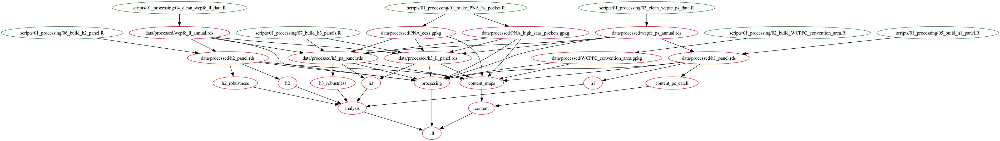

# Limited Conservation Benefits From the First Marine Protected Area in the High Seas

[](preregistration/PNA_HS_closure_prereg_v2.pdf)

Data and code for our evaluation of the world's first large-scale spatial closure
in areas beyond national jurisdiction.

**Authors:** [Juan Carlos Villaseñor-Derbez](mailto:jc_villasenor@miami.edu),
John Lynham

## Repository structure

```
.
├── Makefile                 # rebuilds the whole pipeline (see below)
├── .Rprofile                # activates renv, then sources scripts/00_config.R
├── renv.lock                # pinned package versions (see Requirements)
├── renv/                    # renv infrastructure; library/ is gitignored
├── dag.png                  # dependency graph of the build
├── PNA_HS_closure_prereg.pdf
├── data/
│   ├── raw/                 # never modified by our code
│   ├── processed/           # built by scripts/01_processing
│   └── output/
├── scripts/
│   ├── 00_config.R          # colors, labels, table/figure helpers
│   ├── 01_processing/       # raw data  --> analysis panels
│   ├── 02_analysis/         # panels    --> tables, event studies, summaries
│   └── 03_content/          # panels    --> maps & descriptive figures
├── content/
│   ├── tab/                 # LaTeX regression tables
│   ├── img/                 # figures (png)
│   └── summaries/           # LaTeX summary statistics quoted in the text
├── docs/                    # standalone slide decks / handouts
└── manuscript/              # git submodule --> Overleaf project
```

The `data/raw` folder holds datasets that have not been touched by our code. The
`scripts` folder holds all code, split by objective (process data, analyze data,
or create content). Everything those scripts produce is exported to `content/`. 
The DAG below shows how the pieces connect:



### `manuscript/` is a submodule

`manuscript/` is a git submodule pointing at the Overleaf project. It's only purpose
was to simplify the updating of figures and tables into the text, and bears to 
role in the reproducibility pipeline.

## Data sources

All raw data are publicly available. Large vector files are tracked with
[Git Large-File Storage LFS](https://git-lfs.com) — install it before cloning,
or run `git lfs pull` afterwards.

### Catch and effort

From the [WCPFC Public Domain Aggregated Catch/Effort data download page](https://www.wcpfc.int/wcpfc-public-domain-aggregated-catcheffort-data-download-page),
downloaded **Oct 31, 2025**. Both cover 1950–2023 for the WCPFC Convention Area.

| Fishery | File | Resolution |
|---|---|---|
| Tuna purse seine | `WCPFC_S_PUBLIC_BY_1x1_MM_5` | 1°×1° grid, year and month |
| Tuna longline | `WCPFC_L_PUBLIC_BY_YR_MON_3` | 5°×5° grid, year and month |

### Spatial layers

| Layer | Folder | Source |
|---|---|---|
| Exclusive Economic Zones (v12, 2023-10-25) | `data/raw/World_EEZ_v12_20231025_gpkg` | [Marine Regions](https://www.marineregions.org/) |
| High seas (v2, 2024-10-10) | `data/raw/World_High_Seas_v2_20241010_gpkg` | [Marine Regions](https://www.marineregions.org/) |
| Seamounts (v2) | `data/raw/YessonEtAl2019-Seamounts-V2` | [Yesson et al. 2019](https://doi.org/10.1016/j.dsr.2011.02.004) |

The WCPFC Convention Area polygon is not downloaded. It it is constructed from the
coordinates in Article 3 of the Convention by `scripts/01_processing/02_build_WCPFC_convention_area.R`.

`data/raw/fish_pics/` holds the species and gear icons (SVG) used to annotate the
main figures.

## Requirements

Analysis was run with **R 4.6.1**. Package versions are snapshotted with
[`renv`](https://rstudio.github.io/renv/): `renv.lock` records the exact version
of all 170 packages in the dependency tree, resolved against the
[Posit Package Manager](https://packagemanager.posit.co/cran/latest) CRAN mirror.

`.Rprofile` sources `renv/activate.R`, so opening the project in R activates the
project library automatically. To install it:

```r
renv::restore()
```

That is the only setup step. `renv/library/` is gitignored — the lockfile is the
source of truth, and `renv::restore()` rebuilds the library from it.

Scripts still load packages with `pacman::p_load()`, which now resolves against
the renv library rather than your system library.

Every script resolves paths with `here::here()`, so scripts run correctly from
anywhere in the project. `.Rprofile` also sources
`scripts/00_config.R`, which defines the project-wide color scheme, species
labels, `modelsummary` defaults, and the `save_table()` / `es_save()` helpers used
by every analysis script. If you run a script outside RStudio, source it yourself.

## Reproducing the analysis

The `Makefile` drives the reproducibility pipeline:

```
data/raw        --> data/processed           (scripts/01_processing)
data/processed  --> content/tab, content/img (scripts/02_analysis)
data/processed  --> content/img              (scripts/03_content)
```

```bash
make                # build everything
make processing     # build raw data --> processed panels only
make analysis       # build regression tables and event-study figures only
make content        # build maps and descriptive figures only
make h1             # build a single hypothesis (also: h2, h3,
                    #   h2_robustness, h3_robustness)
make clean          # remove generated tables and figures

# Optional
make dag            # regenerate dag.png (needs make2graph and graphviz)
```

### What each script does

**`scripts/01_processing/`** — raw data to analysis panels

| Script | Output |
|---|---|
| `01_make_PNA_hs_pocket.R` | `PNA_high_seas_pockets.gpkg`, `PNA_eezs.gpkg` |
| `02_build_WCPFC_convention_area.R` | `WCPFC_convention_area.gpkg` |
| `03_clean_wcpfc_ps_data.R` | `wcpfc_ps_annual.rds` |
| `04_clean_wcpfc_ll_data.R` | `wcpfc_ll_annual.rds` |
| `05_build_h1_panel.R` | `h1_panel.rds` — assigns treated/control cells for H1 |
| `06_build_h2_panel.R` | `h2_panel.rds` — assigns treated/control cells for H2 |
| `07_build_h3_panels.R` | `h3_ps_panel.rds`, `h3_ll_panel.rds` — near/far cells |

**`scripts/02_analysis/`** — panels to models, tables, and event studies

| Script | Output |
|---|---|
| `00_basic_stats.R` | scratch script for descriptive tonnage / bigeye mortality numbers quoted in the text; saves nothing, so it is not wired into `make` |
| `01_estimate_h1.R` | `tab/h1_reg*.tex`, `img/h1_*_es.png`, `img/h1_main_figure.png`, `summaries/h1_summaries.tex` |
| `02_estimate_h2.R` | `tab/h2_reg*.tex`, `img/h2_*_es.png`, `img/h2_main_figure.png`, `img/h2_coefplot_*.png`, `img/h2_effort_ts.png`, `summaries/h2_summaries.tex` |
| `02_estimate_h2_robustness_by_pocket.R` | H2 for bigeye split at 152.5°E (HSP1 vs. HSP2) → `h2_rob_pocket_bet_ll.tex` |
| `03_estimate_h3.R` | `tab/h3_reg*.tex`, `img/h3_*_es.png`, `img/h3_main_figure.png`, `summaries/h3_summaries.tex` |
| `03_estimate_h3_robustness_by_pocket.R` | H3 for skipjack split at 152.5°E → `h3_rob_pocket_skj_ps.tex` + event study |

**`scripts/03_content/`** — panels to maps and descriptive figures

| Script | Output |
|---|---|
| `01_make_HS_pocket_map.R` | `fig_HS_pocket_map.png`, `fig_h1_map.png`, `fig_h2_map.png`, `fig_h3_ps_map.png`, `fig_h3_ll_map.png`, `fig_seamount_density.png` |
| `03_fig_ps_catch_inside.R` | `fig_ps_catch_inside.png` — pre-closure purse seine catch composition inside the pockets |
| `04_fig_fishing_in_hs_pockets.R` | diagnostic that rasterizes purse seine presence to check which grid cells count as *fully* covered by a pocket; draws to the device and saves nothing, so it is run by hand rather than through `make` |

## Funding

J.C.V.D. received funding from the Pew Charitable Trusts. The funders had no say in
the design or execution of the research.
